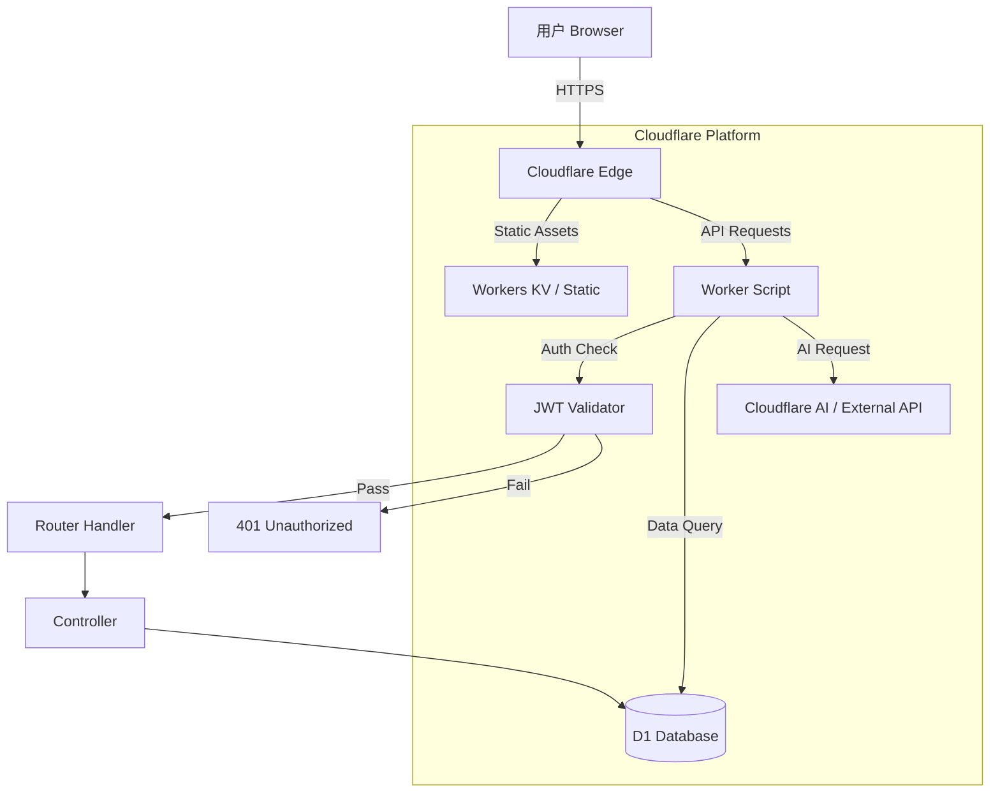

# 架构概览

NavTools 是一个现代化的网站导航管理系统，采用全栈架构部署在 Cloudflare Workers 上。本页面详细介绍系统的技术架构、设计模式和核心实现。

## 技术栈总览

| 模块 | 技术选型 | 说明 |
|------|---------|------|
| **运行时** | Cloudflare Workers | 基于 V8 的边缘计算环境，无冷启动 |
| **数据库** | Cloudflare D1 | 基于 SQLite 的全球分布式数据库 |
| **前端框架** | React 19 | 最新的 React 版本，使用 Hooks 和函数组件 |
| **UI 库** | Material UI 7 | Google Material Design 实现，美观易用 |
| **样式** | Tailwind CSS 4 | 原子化 CSS，灵活高效 |
| **构建工具** | Vite 6 | 极速的开发服务器和构建工具 |
| **路由** | Hono (Router) | 后端路由处理（原生实现类似 Hono 的轻量级路由）|
| **认证** | JWT + bcrypt | 标准的 Web 安全认证方案 |

## 系统架构图



## 目录结构

```
Root/
├── docs/                # 文档站点 (VitePress)
├── migrations/          # 数据库迁移文件
├── src/                 # 前端源代码
│   ├── API/             # API 客户端封装
│   ├── assets/          # 静态资源 (Logo, Icons)
│   ├── components/      # React 组件
│   │   ├── admin/       # 管理员专用组件
│   │   └── dnd/         # 拖拽排序组件
│   ├── App.tsx          # 主应用组件
│   └── main.tsx         # 入口文件
├── worker/              # 后端 Worker 代码
│   └── index.ts         # Worker 入口与逻辑
├── init_table.sql       # 初始数据库结构
├── package.json         # 依赖配置
├── tsconfig.json        # TypeScript 配置
├── vite.config.ts       # Vite 配置
└── wrangler.jsonc       # Cloudflare 部署配置
```

## 核心设计模式

### 1. 单体架构 (Monorepo-like)

虽然代码在一个仓库中，但逻辑上分为前端 (`src/`) 和后端 (`worker/`)。
- **构建时**：Vite 将前端构建为静态资源。
- **部署时**：前端静态资源与 Worker 代码一起打包上传。
- **运行时**：Worker 负责处理 API 请求，并对非 API 请求返回静态资源（HTML/JS/CSS）。

### 2. 边缘优先 (Edge First)

所有逻辑都在边缘节点执行：
- 数据库查询在边缘
- HTML 渲染（SPA Shell）在边缘
- 静态资源缓存在边缘

这确保了全球各地的用户都能获得极低的延迟。

### 3. 读写分离（逻辑上）

- **读操作**：大部分是公开的导航数据，利用 Cloudflare 缓存。
- **写操作**：需要管理员权限，直接操作 D1 数据库。

## 数据库设计

基于 SQLite (D1)，主要包含以下表：

### `groups` (分组表)

| 字段 | 类型 | 说明 |
|------|------|------|
| id | INTEGER | 主键，自增 |
| name | TEXT | 分组名称 |
| icon | TEXT | 分组图标 (Emoji) |
| sort_order | INTEGER | 排序权重 |
| is_public | BOOLEAN | 是否公开 (v1.1.0) |
| created_at | INTEGER | 创建时间 |

### `sites` (站点表)

| 字段 | 类型 | 说明 |
|------|------|------|
| id | INTEGER | 主键，自增 |
| group_id | INTEGER | 外键，关联分组 |
| title | TEXT | 站点标题 |
| url | TEXT | 站点链接 |
| icon | TEXT | 站点图标 URL |
| description | TEXT | 站点描述 |
| sort_order | INTEGER | 排序权重 |
| is_public | BOOLEAN | 是否公开 (v1.1.0) |
| created_at | INTEGER | 创建时间 |

### `config` (配置表)

用于存储全局配置，如自定义 CSS、背景图等。Key-Value 结构。

## 性能优化

- **静态资源内联**：关键的 CSS/JS 小文件直接内联到 HTML，减少 RTT。
- **Favicon 懒加载**：站点图标仅在视图可见时加载。
- **API 聚合**：`/api/data` 接口一次性返回所有分组和站点数据，减少请求次数。
- **预热**：Worker 脚本利用 Cloudflare 的优化机制，保持热启动状态。

## 安全架构

请参考 [安全指南](/security/)。

## 总结

NavTools 的架构设计充分利用了 Cloudflare 平台的优势，实现了：

- **高性能**: 全球边缘计算，低延迟响应
- **高安全**: 多层安全防护，企业级标准
- **低成本**: 充分利用免费额度，零维护成本
