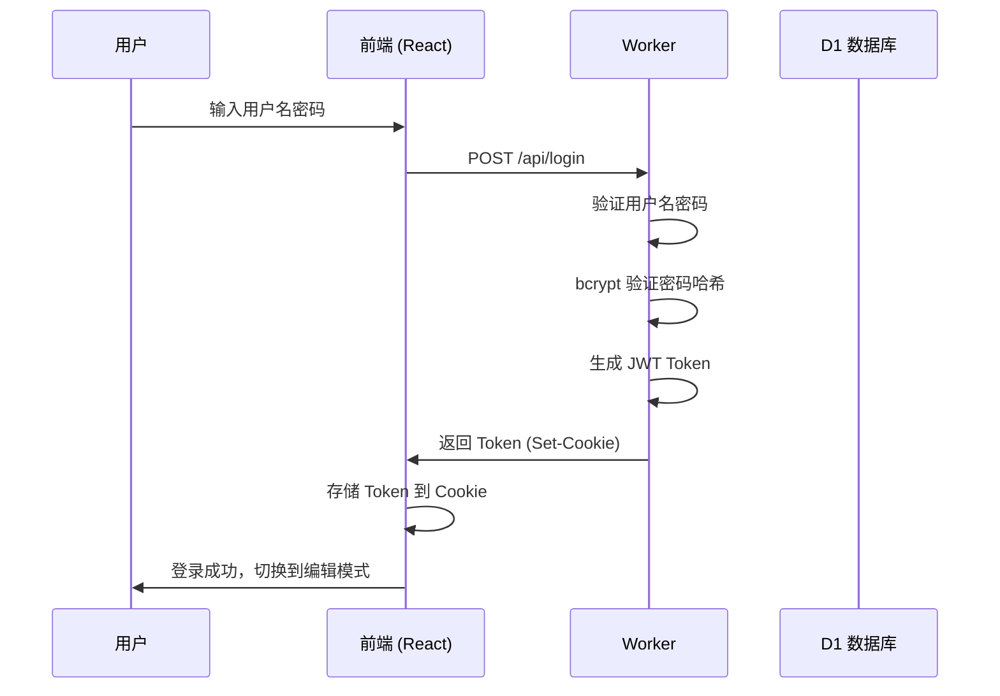
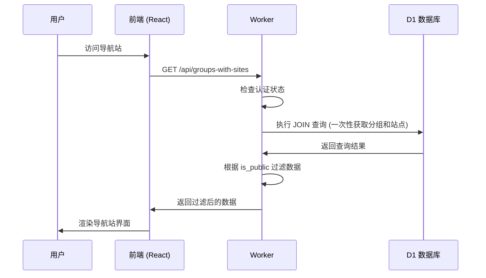
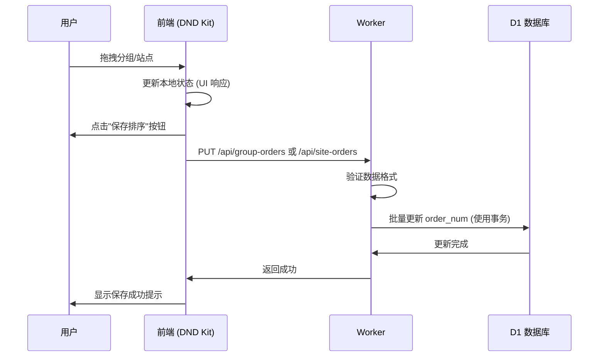

# NaviHive 项目设计文档

## 1. 项目概述

### 1.1 项目简介
NaviHive 是一个现代化的个人导航站管理系统，基于 Cloudflare Workers 构建，支持零成本部署、全球 CDN 加速和企业级安全。

### 1.2 核心特性
- **零成本部署**: 基于 Cloudflare Workers 和 D1，无需购买服务器
- **全球化访问**: Cloudflare CDN 提供全球加速
- **响应式设计**: 完美适配桌面端和移动端
- **拖拽排序**: 支持分组和站点的拖拽排序
- **访问控制**: 支持公开/私密分组和站点
- **数据导入导出**: 支持 JSON 格式的数据备份和恢复
- **主题切换**: 支持明暗主题切换
- **搜索功能**: 内置强大的搜索功能
- **自定义配置**: 支持自定义 CSS、背景图片等

### 1.3 技术栈
| 类别 | 技术 | 版本 | 说明 |
|-----|------|------|------|
| 前端框架 | React | 19.0.0 | 现代化前端框架 |
| 开发语言 | TypeScript | 5.7 | 类型安全的 JavaScript |
| UI 组件库 | Material UI | 7.0.1 | Google Material Design 组件库 |
| 样式方案 | Tailwind CSS | 4.1.2 | 实用优先的 CSS 框架 |
| 拖拽库 | DND Kit | 6.3.1 | 现代化的拖拽排序库 |
| 构建工具 | Vite | 6.2.0 | 快速的前端构建工具 |
| 后端运行时 | Cloudflare Workers | - | Serverless 计算平台 |
| 数据库 | Cloudflare D1 | - | 基于 SQLite 的边缘数据库 |
| 认证方案 | JWT + bcrypt-edge | 7.0.4 | 标准化认证方案 |
| 包管理器 | pnpm | - | 快速、节省磁盘空间的包管理器 |

## 2. 系统架构

### 2.1 整体架构
```
┌─────────────────────────────────────────────────────────────┐
│                        用户浏览器                             │
└───────────────────────┬─────────────────────────────────────┘
                        │ HTTPS
┌───────────────────────▼─────────────────────────────────────┐
│                  Cloudflare CDN                             │
│              (全球边缘节点缓存)                              │
└───────────────────────┬─────────────────────────────────────┘
                        │
┌───────────────────────▼─────────────────────────────────────┐
│              Cloudflare Worker (worker/index.ts)            │
│  ┌─────────────────────────────────────────────────────┐  │
│  │  路由层 (Route Handler)                              │  │
│  │  ├─ CORS 处理                                        │  │
│  │  ├─ 认证中间件 (JWT)                                 │  │
│  │  ├─ 速率限制 (Rate Limiter)                          │  │
│  │  └─ 请求验证 (Request Validation)                    │  │
│  └─────────────────────────────────────────────────────┘  │
│  ┌─────────────────────────────────────────────────────┐  │
│  │  API 层 (NavigationAPI - src/API/http.ts)            │  │
│  │  ├─ 认证模块 (Auth)                                  │  │
│  │  ├─ 分组管理 (Groups)                                │  │
│  │  ├─ 站点管理 (Sites)                                 │  │
│  │  ├─ 配置管理 (Configs)                               │  │
│  │  └─ 数据导入导出 (Import/Export)                     │  │
│  └─────────────────────────────────────────────────────┘  │
└───────────────────────┬─────────────────────────────────────┘
                        │
┌───────────────────────▼─────────────────────────────────────┐
│          Cloudflare D1 (SQLite 数据库)                      │
│  ┌──────────────┐  ┌──────────────┐  ┌──────────────┐      │
│  │   groups     │  │    sites     │  │   configs    │      │
│  │  (分组表)    │  │   (站点表)   │  │  (配置表)    │      │
│  └──────────────┘  └──────────────┘  └──────────────┘      │
└─────────────────────────────────────────────────────────────┘

┌─────────────────────────────────────────────────────────────┐
│              前端应用 (React SPA)                             │
│  ┌─────────────────────────────────────────────────────┐  │
│  │  页面层 (App.tsx)                                    │  │
│  │  ├─ 主题管理                                         │  │
│  │  ├─ 认证状态管理                                     │  │
│  │  └─ 路由/页面渲染                                    │  │
│  └─────────────────────────────────────────────────────┘  │
│  ┌─────────────────────────────────────────────────────┐  │
│  │  组件层 (components/)                                │  │
│  │  ├─ GroupCard (分组卡片)                            │  │
│  │  ├─ SiteCard (站点卡片)                             │  │
│  │  ├─ LoginForm (登录表单)                            │  │
│  │  ├─ SearchBox (搜索框)                              │  │
│  │  └─ SettingsDialog (设置对话框)                     │  │
│  └─────────────────────────────────────────────────────┘  │
│  ┌─────────────────────────────────────────────────────┐  │
│  │  API 客户端层 (API/client.ts)                        │  │
│  │  ├─ HTTP 请求封装                                    │  │
│  │  ├─ Token 管理                                       │  │
│  │  └─ 错误处理                                         │  │
│  └─────────────────────────────────────────────────────┘  │
└─────────────────────────────────────────────────────────────┘
```

### 2.2 数据流

#### 2.2.1 用户登录流程


#### 2.2.2 数据查询流程


#### 2.2.3 拖拽排序流程


## 3. 数据库设计

### 3.1 数据表结构

#### 3.1.1 groups (分组表)
```sql
CREATE TABLE groups (
    id INTEGER PRIMARY KEY AUTOINCREMENT,    -- 分组 ID
    name TEXT NOT NULL,                       -- 分组名称
    order_num INTEGER NOT NULL,               -- 排序序号
    is_public INTEGER DEFAULT 1,             -- 是否公开 (0=私密, 1=公开)
    created_at TIMESTAMP DEFAULT CURRENT_TIMESTAMP,
    updated_at TIMESTAMP DEFAULT CURRENT_TIMESTAMP
);

-- 索引优化
CREATE INDEX idx_groups_is_public ON groups(is_public);
```

**字段说明**:
- `id`: 自增主键，唯一标识分组
- `name`: 分组显示名称，最长 100 字符
- `order_num`: 排序序号，数值越小越靠前
- `is_public`: 访问控制标识，0 表示仅管理员可见，1 表示所有访客可见
- `created_at`: 创建时间
- `updated_at`: 最后更新时间

#### 3.1.2 sites (站点表)
```sql
CREATE TABLE sites (
    id INTEGER PRIMARY KEY AUTOINCREMENT,    -- 站点 ID
    group_id INTEGER NOT NULL,                -- 所属分组 ID
    name TEXT NOT NULL,                       -- 站点名称
    url TEXT NOT NULL,                        -- 站点 URL
    icon TEXT,                                -- 站点图标 URL
    description TEXT,                         -- 站点描述
    notes TEXT,                               -- 备注
    order_num INTEGER NOT NULL,               -- 排序序号
    is_public INTEGER DEFAULT 1,             -- 是否公开 (0=私密, 1=公开)
    created_at TIMESTAMP DEFAULT CURRENT_TIMESTAMP,
    updated_at TIMESTAMP DEFAULT CURRENT_TIMESTAMP,
    FOREIGN KEY (group_id) REFERENCES groups(id) ON DELETE CASCADE
);

-- 索引优化
CREATE INDEX idx_sites_is_public ON sites(is_public);
```

**字段说明**:
- `id`: 自增主键，唯一标识站点
- `group_id`: 外键，关联到 groups 表，删除分组时级联删除站点
- `name`: 站点显示名称，最长 100 字符
- `url`: 站点访问 URL，自动补全 https://
- `icon`: 站点图标 URL，支持外部链接和 base64
- `description`: 站点描述，最长 500 字符
- `notes`: 备注信息，最长 1000 字符
- `order_num`: 排序序号，数值越小越靠前
- `is_public`: 访问控制标识

#### 3.1.3 configs (配置表)
```sql
CREATE TABLE configs (
    key TEXT PRIMARY KEY,                     -- 配置键
    value TEXT NOT NULL,                      -- 配置值
    created_at TIMESTAMP DEFAULT CURRENT_TIMESTAMP,
    updated_at TIMESTAMP DEFAULT CURRENT_TIMESTAMP
);
```

**字段说明**:
- `key`: 配置项的唯一键名
- `value`: 配置项的值（字符串格式）
- 预定义配置项:
  - `site.title`: 网站标题（浏览器标签）
  - `site.name`: 网站名称（页面显示）
  - `site.iconApi`: 图标 API URL 模板
  - `site.backgroundImage`: 背景图片 URL
  - `site.backgroundOpacity`: 背景蒙版透明度 (0-1)
  - `site.customCss`: 自定义 CSS
  - `site.searchBoxEnabled`: 是否启用搜索框
  - `site.searchBoxGuestEnabled`: 访客是否可用搜索框

### 3.2 数据关系图
```
┌─────────────────┐         ┌─────────────────┐
│     groups      │1        │N     sites      │
├─────────────────┤─────────├─────────────────┤
│ id (PK)         │         │ id (PK)         │
│ name            │         │ group_id (FK)   │
│ order_num       │         │ name            │
│ is_public       │         │ url             │
│ created_at      │         │ icon            │
│ updated_at      │         │ description     │
└─────────────────┘         │ notes           │
                            │ order_num       │
                            │ is_public       │
                            │ created_at      │
                            │ updated_at      │
                            └─────────────────┘

┌─────────────────┐
│    configs      │
├─────────────────┤
│ key (PK)        │
│ value           │
│ created_at      │
│ updated_at      │
└─────────────────┘
```

### 3.3 数据库优化策略

#### 3.3.1 查询优化
1. **N+1 查询问题解决方案**
   - 使用 `LEFT JOIN` 一次性获取分组及其站点
   - 避免循环查询，显著提升性能

2. **索引优化**
   - 在 `is_public` 字段上创建索引，加速权限过滤
   - 在 `order_num` 字段上利用 SQLite 自动索引

3. **事务支持**
   - 批量更新排序使用 `batch()` 方法
   - 保证所有操作原子性，避免部分失败

#### 3.3.2 数据验证
- 所有输入数据在 Worker 层进行严格验证
- URL 格式自动校验和修正
- 字段长度限制防止注入攻击

## 4. API 设计

### 4.1 API 列表

#### 4.1.1 认证相关

| 方法 | 路径 | 描述 | 认证 |
|-----|------|------|------|
| POST | /api/login | 用户登录 | 否 |
| POST | /api/logout | 用户登出 | 否 |
| GET | /api/auth/status | 检查认证状态 | 否 |

#### 4.1.2 分组管理

| 方法 | 路径 | 描述 | 认证 |
|-----|------|------|------|
| GET | /api/groups | 获取所有分组 | 根据配置 |
| GET | /api/groups/:id | 获取指定分组 | 根据配置 |
| POST | /api/groups | 创建分组 | 是 |
| PUT | /api/groups/:id | 更新分组 | 是 |
| DELETE | /api/groups/:id | 删除分组 | 是 |
| PUT | /api/group-orders | 批量更新分组排序 | 是 |

#### 4.1.3 站点管理

| 方法 | 路径 | 描述 | 认证 |
|-----|------|------|------|
| GET | /api/sites | 获取所有站点 | 根据配置 |
| GET | /api/sites/:id | 获取指定站点 | 根据配置 |
| POST | /api/sites | 创建站点 | 是 |
| PUT | /api/sites/:id | 更新站点 | 是 |
| DELETE | /api/sites/:id | 删除站点 | 是 |
| PUT | /api/site-orders | 批量更新站点排序 | 是 |

#### 4.1.4 配置管理

| 方法 | 路径 | 描述 | 认证 |
|-----|------|------|------|
| GET | /api/configs | 获取所有配置 | 根据配置 |
| GET | /api/configs/:key | 获取指定配置 | 根据配置 |
| PUT | /api/configs/:key | 更新配置 | 是 |
| DELETE | /api/configs/:key | 删除配置 | 是 |

#### 4.1.5 数据导入导出

| 方法 | 路径 | 描述 | 认证 |
|-----|------|------|------|
| GET | /api/export | 导出所有数据 | 是 |
| POST | /api/import | 导入数据 | 是 |
| GET | /api/groups-with-sites | 获取分组和站点（优化版） | 根据配置 |

#### 4.1.6 系统管理

| 方法 | 路径 | 描述 | 认证 |
|-----|------|------|------|
| GET | /api/init | 初始化数据库 | 否 |

### 4.2 请求/响应格式

#### 4.2.1 登录请求
```json
POST /api/login
Content-Type: application/json

{
  "username": "admin",
  "password": "password",
  "rememberMe": true
}
```

**响应**:
```json
{
  "success": true,
  "message": "登录成功"
}
```
*注意: Token 通过 HttpOnly Cookie 返回*

#### 4.2.2 创建分组
```json
POST /api/groups
Content-Type: application/json

{
  "name": "常用工具",
  "order_num": 0,
  "is_public": 1
}
```

**响应**:
```json
{
  "id": 1,
  "name": "常用工具",
  "order_num": 0,
  "is_public": 1,
  "created_at": "2025-01-01T00:00:00.000Z",
  "updated_at": "2025-01-01T00:00:00.000Z"
}
```

#### 4.2.3 创建站点
```json
POST /api/sites
Content-Type: application/json

{
  "group_id": 1,
  "name": "GitHub",
  "url": "https://github.com",
  "icon": "https://github.githubassets.com/favicons/favicon.svg",
  "description": "代码托管平台",
  "notes": "",
  "order_num": 0,
  "is_public": 1
}
```

#### 4.2.4 批量更新排序
```json
PUT /api/group-orders
Content-Type: application/json

[
  { "id": 1, "order_num": 1 },
  { "id": 2, "order_num": 0 }
]
```

#### 4.2.5 导出数据
```json
GET /api/export

{
  "groups": [...],
  "sites": [...],
  "configs": {...},
  "version": "1.0",
  "exportDate": "2025-01-01T00:00:00.000Z"
}
```

#### 4.2.6 导入数据
```json
POST /api/import
Content-Type: application/json

{
  "groups": [...],
  "sites": [...],
  "configs": {...},
  "version": "1.0",
  "exportDate": "2025-01-01T00:00:00.000Z"
}
```

**响应**:
```json
{
  "success": true,
  "stats": {
    "groups": {
      "total": 10,
      "created": 5,
      "merged": 5
    },
    "sites": {
      "total": 100,
      "created": 80,
      "updated": 15,
      "skipped": 5
    }
  }
}
```

### 4.3 错误响应格式

```json
{
  "success": false,
  "message": "错误描述信息",
  "errorId": "uuid-v4"
}
```

**常见错误码**:
- 400: 请求参数错误
- 401: 未认证或 Token 无效
- 404: 资源不存在
- 429: 速率限制
- 500: 服务器内部错误

### 4.4 认证机制

#### 4.4.1 JWT Token 结构
```
Header: {"alg":"HS256","typ":"JWT"}
Payload: {"username":"admin","exp":1234567890,"iat":1234567890}
Signature: HMACSHA256(base64UrlEncode(header) + "." + base64UrlEncode(payload), secret)
```

#### 4.4.2 Token 有效期
- 默认: 24 小时
- 记住我: 30 天

#### 4.4.3 认证流程
1. 用户登录成功后，Worker 生成 JWT Token
2. Token 通过 HttpOnly Cookie 返回给浏览器
3. 后续请求自动携带 Cookie
4. Worker 验证 Token 签名和有效期
5. 验证通过后允许访问受保护资源

## 5. 前端设计

### 5.1 组件架构

```
App.tsx (根组件)
├── ThemeProvider (主题提供者)
├── Container (主容器)
│   ├── Header (头部)
│   │   ├── SiteTitle (网站标题)
│   │   ├── ActionButtons (操作按钮)
│   │   │   ├── AddGroupButton (新增分组)
│   │   │   ├── MenuButton (更多选项菜单)
│   │   │   └── ThemeToggle (主题切换)
│   ├── SearchBox (搜索框)
│   ├── GroupList (分组列表)
│   │   ├── SortableGroupItem (可排序分组项 - 排序模式)
│   │   └── GroupCard (分组卡片 - 普通模式)
│   │       ├── GroupHeader (分组头部)
│   │       ├── SiteList (站点列表)
│   │       │   ├── SortableSiteItem (可排序站点项)
│   │       │   └── SiteCard (站点卡片)
│   ├── Dialogs (对话框)
│   │   ├── AddGroupDialog (新增分组对话框)
│   │   ├── AddSiteDialog (新增站点对话框)
│   │   ├── ConfigDialog (配置对话框)
│   │   └── ImportDialog (导入对话框)
│   └── Snackbars (提示框)
│       ├── ErrorSnackbar (错误提示)
│       └── SuccessSnackbar (成功提示)
```

### 5.2 状态管理

#### 5.2.1 核心状态
```typescript
// 认证状态
interface AuthState {
  isAuthChecking: boolean;      // 是否正在检查认证
  isAuthenticated: boolean;    // 是否已认证
  isAuthRequired: boolean;      // 是否需要认证
  viewMode: 'readonly' | 'edit'; // 访问模式
}

// 数据状态
interface DataState {
  groups: GroupWithSites[];      // 分组及其站点
  configs: Record<string, string>; // 配置项
  loading: boolean;             // 加载状态
  error: string | null;         // 错误信息
}

// UI 状态
interface UIState {
  darkMode: boolean;            // 暗色模式
  sortMode: SortMode;           // 排序模式
  openAddGroup: boolean;        // 新增分组对话框
  openAddSite: boolean;         // 新增站点对话框
  openConfig: boolean;          // 配置对话框
  openImport: boolean;          // 导入对话框
}
```

#### 5.2.2 状态流向
```
用户操作
  ↓
事件处理函数
  ↓
状态更新 (setState)
  ↓
组件重新渲染
  ↓
UI 更新
```

### 5.3 核心组件说明

#### 5.3.1 App.tsx (主应用组件)
**职责**:
- 应用级状态管理
- 认证流程控制
- 路由/页面渲染
- 全局错误处理

**关键方法**:
- `checkAuthStatus()`: 检查认证状态
- `fetchData()`: 加载导航数据
- `fetchConfigs()`: 加载配置
- `handleLogin()`: 处理登录
- `handleLogout()`: 处理登出

#### 5.3.2 GroupCard.tsx (分组卡片组件)
**职责**:
- 渲染分组信息
- 渲染分组下的站点列表
- 处理分组操作 (编辑、删除、排序)
- 根据访问模式显示不同操作按钮

**Props**:
```typescript
interface GroupCardProps {
  group: GroupWithSites;
  sortMode: 'None' | 'SiteSort';
  currentSortingGroupId: number | null;
  viewMode: 'readonly' | 'edit';
  onUpdate: (site: Site) => void;
  onDelete: (siteId: number) => void;
  onSaveSiteOrder: (groupId: number, sites: Site[]) => void;
  onStartSiteSort: (groupId: number) => void;
  onAddSite: (groupId: number) => void;
  onUpdateGroup: (group: Group) => void;
  onDeleteGroup: (groupId: number) => void;
  configs: Record<string, string>;
}
```

#### 5.3.3 SiteCard.tsx (站点卡片组件)
**职责**:
- 渲染站点信息 (图标、名称、描述)
- 处理站点操作 (编辑、删除)
- 处理站点跳转

#### 5.3.4 SearchBox.tsx (搜索框组件)
**职责**:
- 提供搜索输入框
- 实时过滤分组和站点
- 显示搜索结果
- 处理搜索结果点击事件

#### 5.3.5 LoginForm.tsx (登录表单组件)
**职责**:
- 渲染登录表单
- 表单验证
- 调用登录 API

### 5.4 样式方案

#### 5.4.1 Material UI 主题
```typescript
const theme = createTheme({
  palette: {
    mode: darkMode ? 'dark' : 'light',
    // ...
  },
});
```

#### 5.4.2 Tailwind CSS
- 用于快速布局和实用样式
- 与 Material UI 组件混合使用

#### 5.4.3 自定义 CSS
- 通过配置表的 `site.customCss` 字段注入
- 支持深度定制外观

#### 5.4.4 响应式设计
- 使用 Material UI 的断点系统 (`xs`, `sm`, `md`, `lg`, `xl`)
- 移动端优化:
  - 单列布局
  - 折叠菜单
  - 触摸友好的按钮尺寸

### 5.5 拖拽排序实现

#### 5.5.1 DND Kit 配置
```typescript
const sensors = useSensors(
  useSensor(PointerSensor, {
    activationConstraint: { distance: 1 }
  }),
  useSensor(TouchSensor, {
    activationConstraint: { delay: 100, tolerance: 3 }
  }),
  useSensor(KeyboardSensor, {
    coordinateGetter: sortableKeyboardCoordinates
  })
);
```

#### 5.5.2 拖拽流程
1. 用户拖拽元素
2. DND Kit 检测拖拽事件
3. 更新本地 UI 状态 (实时响应)
4. 用户点击"保存排序"
5. 批量更新到数据库
6. 重新加载数据

## 6. 安全设计

### 6.1 认证安全

#### 6.1.1 密码存储
- 使用 bcrypt 算法哈希密码
- 盐值自动生成和管理
- 默认成本因子: 10

#### 6.1.2 JWT Token 安全
- 使用 HMAC-SHA256 签名
- Token 存储在 HttpOnly Cookie
- Cookie 属性:
  - `HttpOnly`: 防止 XSS 窃取
  - `Secure`: 仅 HTTPS 传输
  - `SameSite=Strict`: 防止 CSRF
  - `Path=/`: 限制作用域

#### 6.1.3 速率限制
- 登录接口: 5 次/15 分钟/IP
- 使用内存实现的速率限制器
- 超限返回 429 状态码

### 6.2 数据验证

#### 6.2.1 输入验证
- 所有 API 请求体大小限制: 1MB
- JSON 格式验证
- 字段类型验证
- URL 格式验证
- 字段长度限制

#### 6.2.2 SQL 注入防护
- 使用参数化查询
- 字段白名单机制
- D1 自动转义

#### 6.2.3 XSS 防护
- 自定义 CSS 通过 `sanitizeCSS()` 函数清理
- URL 验证防止 `javascript:` 协议
- React 自动转义 JSX 内容

### 6.3 CORS 配置

#### 6.3.1 允许的源
- 开发环境: `http://localhost:5173`, `http://localhost:8788`
- 生产环境: 同源、`.workers.dev` 子域名
- 禁止使用通配符 `*`

#### 6.3.2 CORS 头
```http
Access-Control-Allow-Origin: https://your-domain.com
Access-Control-Allow-Methods: GET, POST, PUT, DELETE, OPTIONS
Access-Control-Allow-Headers: Content-Type, Authorization
Access-Control-Allow-Credentials: true
Access-Control-Max-Age: 86400
```

### 6.4 访问控制

#### 6.4.1 权限模型
```
┌─────────────────┐         ┌─────────────────┐
│    访客          │         │    管理员        │
├─────────────────┤         ├─────────────────┤
│ - 查看公开分组   │         │ - 查看所有分组    │
│ - 查看公开站点   │         │ - 查看所有站点    │
│ - 使用搜索框*    │         │ - 创建/编辑分组   │
│                 │         │ - 创建/编辑站点   │
│                 │         │ - 删除分组/站点   │
│                 │         │ - 导出/导入数据   │
│                 │         │ - 修改配置       │
└─────────────────┘         └─────────────────┘

*根据配置决定
```

#### 6.4.2 权限检查流程
```typescript
1. 检查 AUTH_ENABLED 环境变量
2. 如果启用认证:
   a. 从 Cookie 读取 Token
   b. 验证 Token 签名和有效期
   c. 如果无效且需要强制认证 → 返回 401
   d. 如果有效 → 允许访问所有资源
3. 如果未启用认证:
   a. 所有路由允许访问
4. 只读路由免认证 (可配置)
```

## 7. 性能优化

### 7.1 前端优化

#### 7.1.1 代码分割
- React 组件懒加载
- Vite 自动代码分割
- 减少初始加载体积

#### 7.1.2 资源优化
- 图标使用 SVG 格式
- 图片支持外部 CDN
- 字体使用 Google Fonts 子集化

#### 7.1.3 缓存策略
- React Query 或 SWR (可选)
- API 响应缓存
- 本地存储主题偏好

### 7.2 后端优化

#### 7.2.1 数据库优化
- 使用 `LEFT JOIN` 避免 N+1 查询
- 在 `is_public` 字段上创建索引
- 批量操作使用事务

#### 7.2.2 Worker 优化
- Cloudflare CDN 自动缓存静态资源
- Worker 冷启动优化
- 减少 CPU 密集型操作

### 7.3 网络优化

#### 7.3.1 响应压缩
- Cloudflare 自动启用 Brotli/Gzip 压缩

#### 7.3.2 CDN 加速
- 全球边缘节点
- 静态资源缓存
- API 响应缓存 (可选)

## 8. 部署方案

### 8.1 部署流程

#### 8.1.1 准备工作
```bash
1. Fork 项目到自己的 GitHub 账号
2. 安装依赖: pnpm install
3. 配置 wrangler.jsonc
```

#### 8.1.2 部署步骤
```bash
1. 构建: pnpm build
2. 部署: pnpm deploy
3. 初始化数据库: 访问 https://your-worker.com/api/init
4. 配置环境变量
5. 测试访问
```

### 8.2 环境变量配置

| 变量名 | 类型 | 说明 | 必填 |
|-------|------|------|------|
| AUTH_ENABLED | string | 是否启用认证 ("true"/"false") | 否 |
| AUTH_USERNAME | string | 管理员用户名 | 否 |
| AUTH_PASSWORD | string | 密码哈希 (bcrypt) | 否 |
| AUTH_SECRET | string | JWT 密钥 | 否 |

**生成密码哈希**:
```bash
pnpm hash-password
```

### 8.3 D1 数据库初始化

#### 8.3.1 创建数据库
```bash
wrangler d1 create mynav
```

#### 8.3.2 配置绑定
在 `wrangler.jsonc` 中:
```jsonc
{
  "d1_databases": [
    {
      "binding": "DB",
      "database_name": "mynav",
      "database_id": "your-database-id"
    }
  ]
}
```

#### 8.3.3 初始化表结构
```bash
wrangler d1 execute mynav --file=./init_table.sql
```

或通过 Web API:
```
GET https://your-worker.com/api/init
```

## 9. 开发指南

### 9.1 本地开发

#### 9.1.1 启动开发服务器
```bash
pnpm dev
```
访问: http://localhost:5173

#### 9.1.2 启动 Worker 开发服务器
```bash
wrangler dev
```
访问: http://localhost:8788

### 9.2 代码规范

#### 9.2.1 命名规范
- 组件: `PascalCase` (如 `GroupCard`)
- 函数/变量: `camelCase` (如 `handleClick`)
- 常量: `SCREAMING_SNAKE_CASE` (如 `MAX_BODY_SIZE`)
- 类型/接口: `PascalCase` (如 `GroupWithSites`)

#### 9.2.2 代码格式化
```bash
# 格式化代码
pnpm format

# 检查格式
pnpm format:check

# 代码检查
pnpm lint
```

#### 9.2.3 提交规范
使用 Conventional Commits:
- `feat:`: 新功能
- `fix:`: 修复 Bug
- `docs:`: 文档更新
- `style:`: 代码格式调整
- `refactor:`: 重构
- `test:`: 测试相关
- `chore:`: 构建/工具链相关

### 9.3 测试策略

#### 9.3.1 单元测试 (待实现)
- 使用 Vitest + React Testing Library
- 测试文件命名: `ComponentName.test.tsx`

#### 9.3.2 集成测试
- 手动测试核心功能:
  - 认证流程
  - CRUD 操作
  - 拖拽排序
  - 数据导入导出

#### 9.3.3 E2E 测试 (待实现)
- 使用 Playwright
- 测试关键用户流程

## 10. 故障排查

### 10.1 常见问题

#### 10.1.1 数据库连接失败
**症状**: API 返回 500 错误
**解决**:
- 检查 `wrangler.jsonc` 中的 D1 绑定配置
- 确认数据库 ID 正确
- 运行 `wrangler d1 list` 查看数据库列表

#### 10.1.2 认证失败
**症状**: 登录返回"用户名或密码错误"
**解决**:
- 检查环境变量 `AUTH_USERNAME` 和 `AUTH_PASSWORD`
- 重新生成密码哈希: `pnpm hash-password`
- 确认 `AUTH_ENABLED` 设置为 `true`

#### 10.1.3 拖拽不工作
**症状**: 无法拖拽分组或站点
**解决**:
- 确认已登录
- 点击"编辑排序"按钮进入排序模式
- 检查浏览器控制台是否有错误

#### 10.1.4 图标不显示
**症状**: 站点图标加载失败
**解决**:
- 检查图标 URL 是否正确
- 确认 `site.iconApi` 配置正确
- 尝试手动输入图标 URL

### 10.2 日志查看

#### 10.2.1 Worker 日志
```bash
wrangler tail
```

#### 10.2.2 浏览器控制台
- 打开开发者工具 (F12)
- 查看 Console 标签页
- 查看 Network 标签页检查 API 请求

## 11. 未来规划

### 11.1 短期规划 (V1.2)
- [ ] 添加单元测试和 E2E 测试
- [ ] 支持多用户系统
- [ ] 添加标签系统
- [ ] 优化移动端体验

### 11.2 中期规划 (V2.0)
- [ ] 支持 Cloudflare R2 存储图片
- [ ] 添加统计功能 (访问量、点击量)
- [ ] 支持主题商店
- [ ] 添加快捷键支持

### 11.3 长期规划
- [ ] 支持团队协作
- [ ] API 文档自动生成
- [ ] 国际化支持 (i18n)
- [ ] 插件系统

## 12. 附录

### 12.1 项目结构
```
Cloudflare-Navihive/
├── src/                      # 前端源码
│   ├── API/                  # API 相关
│   │   ├── client.ts        # HTTP 客户端
│   │   ├── http.ts          # API 类型定义
│   │   └── mock.ts          # Mock 数据
│   ├── assets/              # 静态资源
│   ├── components/          # React 组件
│   ├── config/              # 配置文件
│   ├── utils/               # 工具函数
│   ├── App.tsx              # 主应用组件
│   ├── main.tsx             # 应用入口
│   └── types.ts             # 类型定义
├── worker/                   # Worker 源码
│   └── index.ts             # Worker 入口
├── docs/                     # 文档
├── public/                   # 公共资源
├── scripts/                  # 脚本工具
├── init_table.sql           # 数据库初始化脚本
├── wrangler.jsonc           # Wrangler 配置
├── vite.config.ts           # Vite 配置
├── package.json             # 依赖配置
└── tsconfig.json            # TypeScript 配置
```

### 12.2 依赖清单

#### 12.2.1 核心依赖
```json
{
  "react": "^19.0.0",
  "react-dom": "^19.0.0",
  "@mui/material": "^7.0.1",
  "@mui/icons-material": "^7.0.1",
  "@dnd-kit/core": "^6.3.1",
  "@dnd-kit/sortable": "^10.0.0",
  "tailwindcss": "^4.1.2"
}
```

#### 12.2.2 开发依赖
```json
{
  "typescript": "~5.7.2",
  "vite": "^6.2.0",
  "eslint": "^9.21.0",
  "prettier": "^3.2.8",
  "wrangler": "^4.7.2"
}
```

### 12.3 参考资料

- [Cloudflare Workers 文档](https://developers.cloudflare.com/workers/)
- [Cloudflare D1 文档](https://developers.cloudflare.com/d1/)
- [React 文档](https://react.dev/)
- [Material UI 文档](https://mui.com/)
- [DND Kit 文档](https://dndkit.com/)
- [Tailwind CSS 文档](https://tailwindcss.com/)

---

**文档版本**: 1.0.0
**最后更新**: 2025-01-03
**维护者**: zqq-nuli
